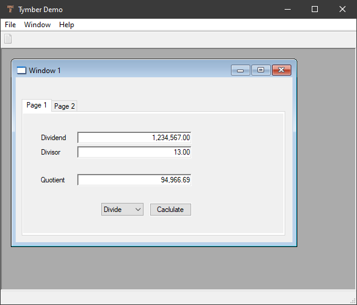
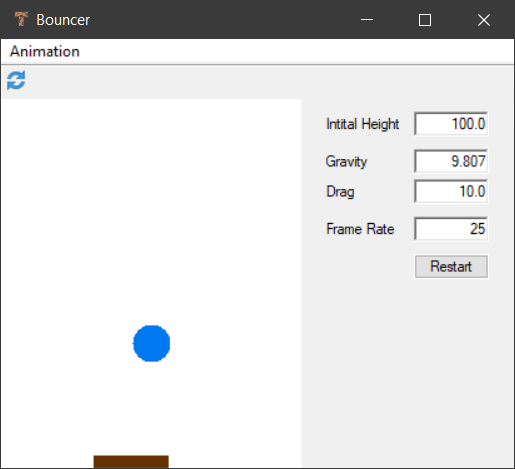

# Tymber
Python GUI toolkit on Windows. Simple and lean.


Code examples

### Hello

```python
import tymber as ty

window = ty.Window("Hello!")
window.run()    # show as modal
```

### Hello World

```python
import tymber as ty

def button__on_click(button):
    button.parent.close()

app = ty.Application(ty.Window("Tymber", width=360, height=280))
label = ty.Label(app.window, "label", 20, 60, -20, 22, "Hello World!")
label.align_h = ty.Align.center
button = ty.Button(app.window, "button", -70, -40, 50, 20, "Close")
button.on_click = button__on_click
app.run()
```

### Screen Shots





## Usage

1. Install Python for Windows.
2. Download the `tymber.pyd` file for your version of Python from the respective subdirectory of `bin` (e.g. `39_64` for Python 3.9, 64 bit).
3. Put it into the directory of your script and import it.

In the files `demo.py` and `Lybniz.py` you find examples of application code.

Here is some [documentation](tymber.html).
